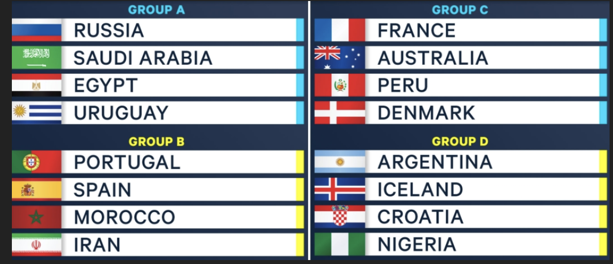

# SP1 - Skuffeprojektet
I første studypoint opgave demonstrerer du at du har fået styr det vi kalder byggeklodserne indenfor programmering. 

Opgaven laves i Processing, og afleveres lige inden vi går over til IntelliJ.

Vi kalder opgaven et "skuffeprojekt" fordi du arbejder på det i små ryk over længere tid.


### Hvordan skal jeg arbejde med det? 
 - Start med projektet allerede fra første uge, hvor du prøver det af du har lært.
 - Tag det op af skuffen en gang om ugen og lav lidt mere, eller lav noget om.
 - Beslut dig for en fast dag hvor du vil arbejde på det (eller to dage måske?)
 - Brug din tutor eller din lærer eller dine studiekammerater, hvis der er noget der driller.

### Læringsmål
 - forstå variable, datatyper, betingelser, loops, funktioner, objekter, lister og hvordan man sætter det hele sammen.
 - forstå at programmer bliver til i en iterativ process
 - forstå "how to kill you darlings": Du vil komme til at skrotte kode som du med stort besvær har skrevet, fordi du nu har fundet en meget smartere måde at gøre det samme på.
Hold en logbog hvor du hver uge skriver ned hvad du har ændret - du kan også vælge at gemme dine ugentlige ændringer i nye versioner.


### SP1: (BUNDEN)
Opgaven går ud på at skabe dette billede i Processing. Det kan laves på mange måder, afhængig af hvad du har i din værktøjskasse.
Herunder har vi ordnet nogle forslag til hvad du kan gøre for at fylde på og forbedre, efter hver uge.



_Det er ikke tilladt at loade hele grafikken ;) Men du må gerne loade hvert enkelt flag._

## Variable
Hvad er data i dette billede? Et par eksempler:
- variabel der holder på landenes navne.
- Stier til deres flag.
- højde og bredde på den hvide baggrund til teksterne
...osv.
- bruge evt. systemvariable som ```width``` og ```height```, til at arbejde med dimensioner og placering af elementerne


 - [Processing reference: Hvordan kan man skrive tekst?](https://processing.org/reference/loadImage_.html)
 - [Processing reference:  Hvordan kan man loade grafik?](https://processing.org/reference/text_.html)

## Loops og betingelser
 - Hvad bliver repeteret her? 
 - Hvad skal der sker i hver iteration.
 - Er dét der sker, betinget af noget?

## Funktioner
 Hvor meget gentager du dig selv i koden?
 - kan du gruppere visse kommandoer i en funktion og så kalde funktionen i stedet for gentage mange linjer?
 - er der kommandoer som ligner hinanden meget uden at være identiske - måske skal du have en funktion der tager variation som argument.


## Objekter og klasser
Hvilke objekter er der i dette billede?
Du ser måske at der er **grupper** bestående af nogle **lande**.
- beskriv de to ting i almindelig text før du skriver en klasse for hver af dem, fx. Group og Country
- Hvad er forholdet mellem de to klasser? (tænk i has-a)
- Hvilke felter skal de hver især have?

## Lister
Nu hvor du har lært om lister som noget der kan holde en bestemt datatyper, hvad så med at tilføje en liste med typen Country til Group?